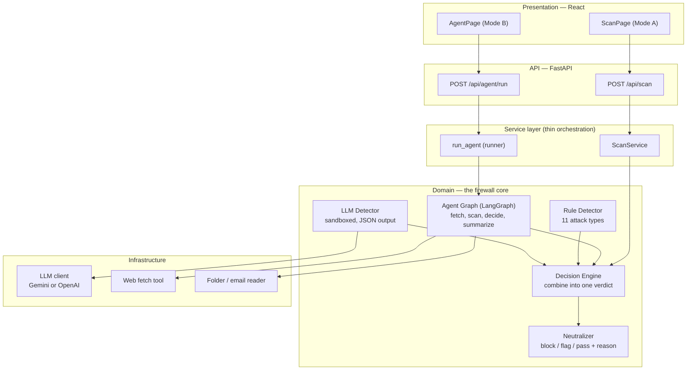
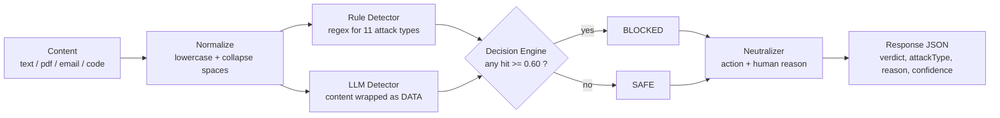
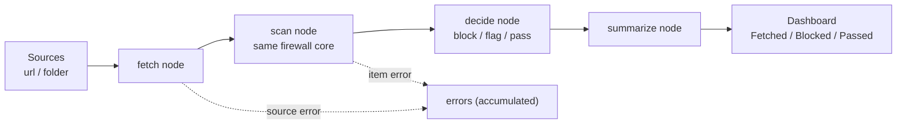

# Architecture — Prompt Injection Firewall

An AI firewall that sits in front of an AI agent, inspects all incoming
content, **detects and neutralizes** prompt-injection attacks, and lets
legitimate content pass with minimal disruption.

The same firewall core is used by **two modes**:
- **Mode A (manual)** — a user pastes/uploads content and scans it.
- **Mode B (agent)** — an autonomous agent fetches content from sources and the
  firewall scans every item automatically.

---

## 1. System layers

---

## 2. Mode A — manual scan flow

**Key actions:** validate → normalize → detect (rules + LLM) → decide → neutralize
→ respond.

---

## 3. Mode B — autonomous agent flow

The agent graph is a **LangGraph StateGraph**:
`START → fetch → scan → decide → summarize → END`.

A failing source or item is recorded in `errors` — the run never aborts.

---

## 4. Decisions (the rules)

| Situation | Result |
|---|---|
| Any detector hit with confidence **≥ 0.60** | 🚫 **BLOCKED** |
| Hit between 0.60 and 0.80 | ⚠️ **flag** (pass with a warning) |
| Hit ≥ 0.80 | 🚫 **block** (hard) |
| No hit | ✅ **SAFE** (pass) |
| LLM unavailable / fails | falls back to the **rule detector** (never 500s) |

---

## 5. Model usage

- **LLM:** Gemini (default `gemini-3.5-flash-lite`) or OpenAI — selected by the
  `LLM_PROVIDER` env var; no code change.
- **Sandboxing:** content is passed to the model as **data** inside `<content>`
  tags, with a system prompt that forbids obeying anything inside it
  (defence against **meta-injection**).
- **Output:** strict JSON `{is_attack, attack_type, confidence, reason}`.
- The model is **label-only** — no tools, no memory, no side effects.

---

## 6. Key features

- **11 attack types** detected (the 9 from the brief + Meta-Injection and
  Output-Side Leak).
- **Defence in depth:** rule detector + sandboxed LLM + fail-soft fallback.
- **Explainability:** every verdict carries an attack type, a reason and a
  confidence score.
- **Agentic (Mode B):** autonomous fetch → scan → decide over many sources.
- **Robust:** per-source error isolation; missing SDK/key degrades to rules only.

---

## 7. How this supports the claimed position (F3 / D2)

| Claim | Evidence in the architecture |
|---|---|
| **F3 — detect ≥ 7 attack types** | `attack_types.py` defines all 11; the rule detector + LLM detector both cover them (tested: 14/14). |
| **D2 — text input, high reliability** | text path (normalize → dual detectors → engine); reliability shown by the test suites (rule 15/15, engine 6/6, agent 7/7). |
| **Detect + neutralize** | `engine` decides; `neutralizer` blocks/flags and explains. |
| **Intercept before the AI** | the firewall sits in front of the protected AI in both modes. |
| **Agentic capability** | Mode B agent fetches and scans autonomously (LangGraph). |

> Note: depth is claimed at **D2** (text, high reliability); multimodal (D3) via
> OCR is future work.
